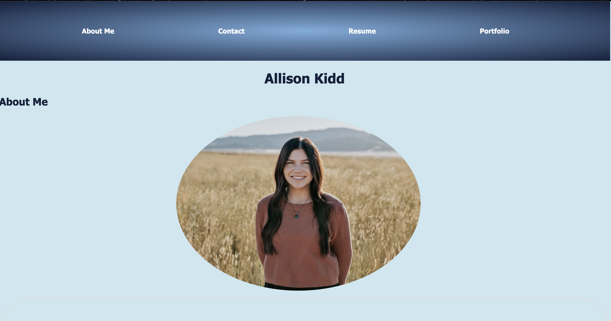

# Allison Kidd's Portfolio
 
 ## Table of Contents
 * [Description](#description)
 * [Installation](#installation)
 * [Usage](#usage)
 * [License](#license)
 * [Contributing](#contributors)
 * [Tests](#test)
 * [Questions](#questions)
 * [Photo](#photo)
 ## Description
   This is my professional portfolio. Please reach out to me if you have any questions.
   ## Installation
  No installation is needed.
  ## Usage
  In your terminal, enter in node index js and answer the prompt questions to generate your readme.
  ## Contributing
  None
  ## Tests
  All tests and debugging were completed using inspector tools.
  ## Questions
   https://github.com/akidd15
   email@email.com
  ## Photo
 
